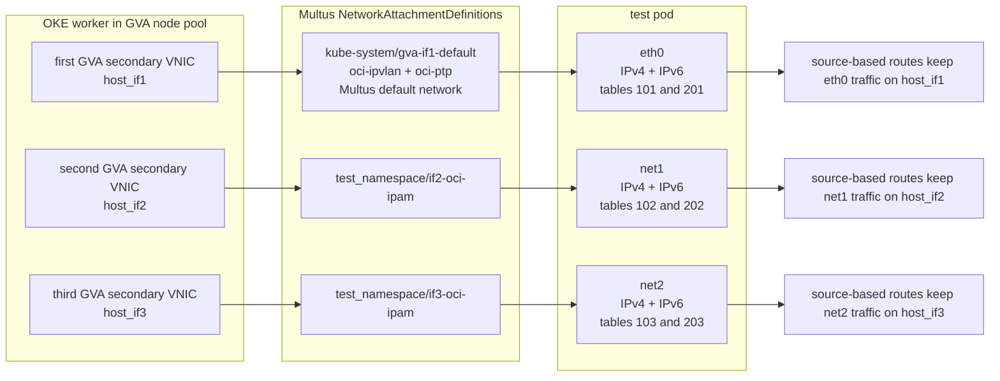

# Dual-Stack OKE GVA Engineer Guide

This guide shows how to create an IPv4/IPv6 dual-stack Oracle Kubernetes Engine cluster, add a Generic VNIC Attachment node pool with three secondary VNICs per worker, attach those networks to pods with Multus, configure source-based pod routing, and verify pod-to-pod IPv4/IPv6 traffic plus IPv4 internet egress.

## What This Builds

| Component | Result |
|---|---|
| OKE cluster | Enhanced cluster, VCN-native pod networking, IPv4 and IPv6 enabled |
| GVA node pool | Two workers, each with three secondary VNICs |
| Pod network shape | `eth0` from the first GVA secondary VNIC, `net1` and `net2` from the second and third |
| IP allocation | `oci-ipam` allocates IPv4 and IPv6 addresses on each pod interface |
| Pod routing | Source-based IPv4 and IPv6 route tables keep traffic on the intended interface |
| Pod IPv4 internet egress | Verified with interface-bound IPv4 `curl` from both test pods |

## Interface And Routing Model



## Scope

This guide proves pod-to-pod IPv4 and IPv6 connectivity across GVA-backed pod interfaces inside the VCN. It does not prove public IPv6 internet egress, Kubernetes Service dual-stack behavior, DNS A/AAAA behavior, or load balancer behavior.

## Placeholder Rules

- Replace every `<...>` value before running the command that contains it.
- Keep quotes around placeholder values unless you intentionally need an unquoted numeric JSON value.
- Run the shell blocks in `bash`.
- Do not paste private keys, kubeconfig contents, or OCI security tokens into this guide.

## OCI Network Requirements

Before creating the cluster or node pool, confirm:

| Area | Requirement |
|---|---|
| Subnets | API, load balancer, worker primary, and GVA secondary subnets are dual stack. |
| GVA subnet capacity | Each GVA secondary subnet has enough free IPv4 and IPv6 addresses for node VNICs and pod IPs. |
| GVA security | Allow IPv4 ICMP and IPv6 ICMP between all GVA secondary subnet CIDRs, both ingress and egress. |
| Optional app traffic | Allow any TCP or UDP ports required by the workload test. |
| GVA routing | Keep local VCN routing between GVA secondary subnets. No NAT or internet gateway is needed for in-VCN pod-to-pod ping tests. |
| IPv4 internet egress | Route `0.0.0.0/0` from each GVA secondary subnet to a NAT gateway or approved IPv4 egress path, and allow matching IPv4 egress in the security list or NSG. |
| Optional IPv6 public egress | For IPv6, verify `::/0` to the intended IPv6 route target and globally routable IPv6 addressing. |
| API access | The operator network can reach the Kubernetes API endpoint. |
| Worker baseline | Worker primary subnet rules still allow normal OKE control-plane and kubelet traffic. |

## Verify Local Tools

These commands prove the local workstation has the required CLIs and OCI CLI flags before any cloud resource is created.

```sh
# Print local tool versions.
oci -v
kubectl version --client
jq --version
bash --version | head -n 1

# Confirm the OCI CLI supports the OKE options used by this guide.
oci ce cluster create --help | grep -- --ip-families
oci ce node-pool create --help | grep -- --secondary-vnics
oci ce node-pool create --help | grep -- --cni-type
```

Expected result:

- The version commands succeed.
- The `grep` commands find `--ip-families`, `--secondary-vnics`, and `--cni-type`.

## 1 Create Cluster Input Files

These JSON files keep the OKE cluster create command readable and make the cluster networking choices explicit.

```sh
# Keep all generated files in one local directory.
mkdir -p generated/dualstack-gva

# Tell OKE to use OCI VCN-native pod networking.
cat > generated/dualstack-gva/cluster-pod-network-options.json <<'EOF'
[
  {
    "cniType": "OCI_VCN_IP_NATIVE"
  }
]
EOF

# Enable both IPv4 and IPv6 for the cluster.
cat > generated/dualstack-gva/ip-families.json <<'EOF'
[
  "IPv4",
  "IPv6"
]
EOF

# Tell OKE which subnets to use for Kubernetes Service resources of type LoadBalancer.
cat > generated/dualstack-gva/service-lb-subnet-ids.json <<'EOF'
[
  "<service_lb_subnet_1_ocid>",
  "<service_lb_subnet_2_ocid>"
]
EOF

# Validate JSON syntax before calling OCI.
jq empty generated/dualstack-gva/cluster-pod-network-options.json
jq empty generated/dualstack-gva/ip-families.json
jq empty generated/dualstack-gva/service-lb-subnet-ids.json
```

Expected result:

- All three `jq empty` commands exit successfully.
- No OCI resources have been created yet.

## 2 Create The Dual-Stack OKE Cluster

This command creates the OKE control plane as an enhanced, VCN-native, dual-stack cluster.

```sh
oci ce cluster create \
  --region "<oci_region>" \
  --compartment-id "<compartment_ocid>" \
  --name "<cluster_name>" \
  --vcn-id "<vcn_ocid>" \
  --kubernetes-version "<oke_kubernetes_version>" \
  --type ENHANCED_CLUSTER \
  --cluster-pod-network-options "file://$(pwd)/generated/dualstack-gva/cluster-pod-network-options.json" \
  --ip-families "file://$(pwd)/generated/dualstack-gva/ip-families.json" \
  --endpoint-subnet-id "<api_endpoint_subnet_ocid>" \
  --endpoint-public-ip-enabled "<true_or_false>" \
  --service-lb-subnet-ids "file://$(pwd)/generated/dualstack-gva/service-lb-subnet-ids.json" \
  --output json
```

Expected result:

- The command returns an `opc-work-request-id`.

Confirm the cluster create work request:

```sh
oci ce work-request get \
  --region "<oci_region>" \
  --work-request-id "<cluster_create_work_request_ocid>" \
  --output json \
  | jq '.data | {status, resources, errors}'
```

Expected result:

- `status` is `SUCCEEDED`.
- `errors` is empty.

Confirm the cluster settings:

```sh
oci ce cluster get \
  --region "<oci_region>" \
  --cluster-id "<cluster_ocid>" \
  --output json \
  | jq '.data | {
      name,
      lifecycleState: ."lifecycle-state",
      type,
      clusterPodNetworkOptions: ."cluster-pod-network-options",
      ipFamilies: ."ip-families"
    }'
```

Expected result:

- `lifecycleState` is `ACTIVE`.
- `type` is `ENHANCED_CLUSTER`.
- `clusterPodNetworkOptions` includes `OCI_VCN_IP_NATIVE`.
- `ipFamilies` includes `IPv4` and `IPv6`.

## 3 Configure Kubectl

This command writes kubeconfig access for the new cluster and verifies that `kubectl` can reach the Kubernetes API server.

```sh
oci ce cluster create-kubeconfig \
  --cluster-id "<cluster_ocid>" \
  --file "$HOME/.kube/config" \
  --region "<oci_region>" \
  --token-version 2.0.0 \
  --kube-endpoint "<PUBLIC_ENDPOINT_or_PRIVATE_ENDPOINT>"

kubectl config use-context "<kubectl_context_name>"
kubectl cluster-info
```

Expected result:

- `kubectl cluster-info` returns the Kubernetes control plane endpoint.

## 4 Create The Secondary VNIC Payload

This JSON file defines the three GVA secondary VNICs OKE will create and attach to each worker in the node pool. Each VNIC requests IPv6 assignment and 16 pod IP allocation slots.

```sh
cat > generated/dualstack-gva/secondary-vnics.json <<'EOF'
[
  {
    "displayName": "vnicattachment-gva-if1",
    "createVnicDetails": {
      "displayName": "vnic-gva-if1",
      "subnetId": "<secondary_subnet_1_ocid>",
      "assignPublicIp": false,
      "assignIpv6Ip": true,
      "skipSourceDestCheck": false,
      "ipCount": 16
    }
  },
  {
    "displayName": "vnicattachment-gva-if2",
    "createVnicDetails": {
      "displayName": "vnic-gva-if2",
      "subnetId": "<secondary_subnet_2_ocid>",
      "assignPublicIp": false,
      "assignIpv6Ip": true,
      "skipSourceDestCheck": false,
      "ipCount": 16
    }
  },
  {
    "displayName": "vnicattachment-gva-if3",
    "createVnicDetails": {
      "displayName": "vnic-gva-if3",
      "subnetId": "<secondary_subnet_3_ocid>",
      "assignPublicIp": false,
      "assignIpv6Ip": true,
      "skipSourceDestCheck": false,
      "ipCount": 16
    }
  }
]
EOF

jq empty generated/dualstack-gva/secondary-vnics.json
```

Expected result:

- `jq empty` exits successfully.
- No `applicationResources` field is present.

## 5 Create The GVA Node Pool

This command creates a two-node OKE worker pool. During node creation, OKE creates and attaches the three secondary VNICs from `secondary-vnics.json` to each worker.

Do not include pod subnet IDs, pod NSG IDs, or `maxPodsPerNode` in this GVA node pool request unless your OCI API version explicitly supports that combination with secondary VNICs.

```sh
oci ce node-pool create \
  --region "<oci_region>" \
  --compartment-id "<compartment_ocid>" \
  --cluster-id "<cluster_ocid>" \
  --name "<gva_node_pool_name>" \
  --kubernetes-version "<oke_kubernetes_version>" \
  --node-shape "<worker_shape>" \
  --node-shape-config '{"ocpus":<ocpus_for_flex_shape>,"memoryInGBs":<memory_gb_for_flex_shape>}' \
  --size 2 \
  --cni-type OCI_VCN_IP_NATIVE \
  --placement-configs '[{"availabilityDomain":"<availability_domain_name>","subnetId":"<worker_primary_subnet_ocid>"}]' \
  --node-source-details '{"sourceType":"IMAGE","imageId":"<oke_worker_image_ocid>"}' \
  --initial-node-labels '[{"key":"network","value":"<gva_nodepool_label>"},{"key":"gva.oraclecloud.com/secondary-vnics","value":"3"}]' \
  --ssh-public-key "<ssh_public_key>" \
  --secondary-vnics "file://$(pwd)/generated/dualstack-gva/secondary-vnics.json" \
  --output json
```

Expected result:

- The command returns an `opc-work-request-id`.

Confirm the node pool create work request:

```sh
oci ce work-request get \
  --region "<oci_region>" \
  --work-request-id "<node_pool_create_work_request_ocid>" \
  --output json \
  | jq '.data | {status, resources, errors}'
```

Confirm the node pool:

```sh
oci ce node-pool get \
  --region "<oci_region>" \
  --node-pool-id "<node_pool_ocid>" \
  --output json \
  | jq '.data | {
      name,
      lifecycleState: ."lifecycle-state",
      clusterId: ."cluster-id",
      size,
      kubernetesVersion: ."kubernetes-version",
      nodeShape: ."node-shape"
    }'
```

Confirm the workers joined the cluster:

```sh
kubectl get nodes -l "network=<gva_nodepool_label>" -o wide
```

Expected result:

- Two workers are listed.
- Both workers are `Ready`.

## 6 Install Multus

Multus provides the Kubernetes `NetworkAttachmentDefinition` CRD and attaches the GVA-backed networks to pods.

```sh
# Install the upstream Multus thick-plugin daemonset.
kubectl apply -f https://raw.githubusercontent.com/k8snetworkplumbingwg/multus-cni/master/deployments/multus-daemonset-thick.yml

# Wait for the Multus daemonset to roll out.
kubectl -n kube-system rollout status ds/kube-multus-ds --timeout=180s

# Confirm the NetworkAttachmentDefinition CRD exists.
kubectl get crd network-attachment-definitions.k8s.cni.cncf.io
```

Expected result:

- `ds/kube-multus-ds` rolls out successfully.
- The NAD CRD exists.

## 7 Create NetworkAttachmentDefinitions

The default NAD backs pod `eth0` with the first GVA secondary VNIC and chains `oci-ipvlan` plus `oci-ptp`. The additional NADs back pod `net1` and `net2` with `ipvlan` plus `oci-ipam`.

### Preferred Generated Path

Use the generator when you do not want to hardcode worker host interface names. It creates a short-lived diagnostic pod, discovers matching host interfaces, and writes the NAD YAML.

```sh
# Pick a Ready GVA worker node name before running this command.
bash scripts/generate_nads_from_node.sh \
  --node "<gva_worker_node_name>" \
  --namespace "<test_namespace>" \
  --default-name gva-if1-default \
  --nad-prefix if \
  --count 3 \
  --output generated/dualstack-gva/nads.yaml

# Create the namespace first so server-side dry-run can validate namespaced NADs.
kubectl create namespace "<test_namespace>" --dry-run=client -o yaml | kubectl apply -f -

# Validate without changing the cluster.
kubectl apply --dry-run=server -f generated/dualstack-gva/nads.yaml

# Create the NADs.
kubectl apply -f generated/dualstack-gva/nads.yaml

# Confirm the default and additional NADs exist.
kubectl -n kube-system get network-attachment-definitions gva-if1-default
kubectl -n "<test_namespace>" get network-attachment-definitions
```

### Manual Fallback

Use this only when the GVA worker host interface names are already known.

```sh
cat > generated/dualstack-gva/nads.yaml <<'EOF'
apiVersion: v1
kind: Namespace
metadata:
  name: <test_namespace>
---
apiVersion: k8s.cni.cncf.io/v1
kind: NetworkAttachmentDefinition
metadata:
  name: gva-if1-default
  namespace: kube-system
spec:
  config: |
    {
      "name": "gva-if1-default",
      "cniVersion": "0.3.1",
      "plugins": [
        {
          "cniVersion": "0.3.1",
          "type": "oci-ipvlan",
          "mode": "l2",
          "ipam": {
            "type": "oci-ipam",
            "deviceSelector": {
              "interfaceName": "<host_if1>"
            }
          }
        },
        {
          "cniVersion": "0.3.1",
          "type": "oci-ptp",
          "containerInterface": "ptp-veth0",
          "mtu": 9000
        }
      ]
    }
---
apiVersion: k8s.cni.cncf.io/v1
kind: NetworkAttachmentDefinition
metadata:
  name: if2-oci-ipam
  namespace: <test_namespace>
spec:
  config: |
    {
      "cniVersion": "0.3.1",
      "type": "ipvlan",
      "mode": "l2",
      "master": "<host_if2>",
      "ipam": {
        "type": "oci-ipam",
        "deviceSelector": {
          "interfaceName": "<host_if2>"
        }
      }
    }
---
apiVersion: k8s.cni.cncf.io/v1
kind: NetworkAttachmentDefinition
metadata:
  name: if3-oci-ipam
  namespace: <test_namespace>
spec:
  config: |
    {
      "cniVersion": "0.3.1",
      "type": "ipvlan",
      "mode": "l2",
      "master": "<host_if3>",
      "ipam": {
        "type": "oci-ipam",
        "deviceSelector": {
          "interfaceName": "<host_if3>"
        }
      }
    }
EOF

kubectl create namespace "<test_namespace>" --dry-run=client -o yaml | kubectl apply -f -
kubectl apply --dry-run=server -f generated/dualstack-gva/nads.yaml
kubectl apply -f generated/dualstack-gva/nads.yaml
```

Expected result:

- `gva-if1-default` exists in `kube-system`.
- `if2-oci-ipam` and `if3-oci-ipam` exist in the test namespace.

## 8 Create Routed Test Pods

These pods receive IPv4 and IPv6 addresses on `eth0`, `net1`, and `net2`. Their startup command configures source-based policy routing so packets sourced from each interface leave through that same interface.

This is needed because Linux normally selects routes by destination, not by the interface that owns the source address. In a multihomed GVA pod, `eth0`, `net1`, and `net2` are backed by different OCI VNIC paths and subnets. Without `ip rule from <source-ip> table <table>` entries, traffic sourced from `net1` or `net2` can still leave through the default route for another interface, which can break return traffic, ping tests, IPv4 internet egress, and application flows that expect symmetric interface use.

The IPv4 default routes in tables `101`, `102`, and `103` are intentional. They send internet-bound IPv4 traffic through the gateway for the subnet that owns the selected source address; the OCI route table for that GVA subnet then forwards `0.0.0.0/0` to the NAT gateway or approved IPv4 egress path.

Replace all placeholders in this manifest before applying it.

```sh
cat > generated/dualstack-gva/pods.yaml <<'EOF'
apiVersion: v1
kind: Pod
metadata:
  name: gva-dualstack-a
  namespace: <test_namespace>
  labels:
    app: gva-dualstack-test
  annotations:
    v1.multus-cni.io/default-network: kube-system/gva-if1-default
    k8s.v1.cni.cncf.io/networks: |
      [
        {"name":"if2-oci-ipam","namespace":"<test_namespace>","interface":"net1"},
        {"name":"if3-oci-ipam","namespace":"<test_namespace>","interface":"net2"}
      ]
spec:
  restartPolicy: Always
  nodeSelector:
    network: <gva_nodepool_label>
  affinity:
    podAntiAffinity:
      requiredDuringSchedulingIgnoredDuringExecution:
        - labelSelector:
            matchLabels:
              app: gva-dualstack-test
          topologyKey: kubernetes.io/hostname
  containers:
    - name: netshoot
      image: docker.io/nicolaka/netshoot:v0.13
      securityContext:
        allowPrivilegeEscalation: false
        capabilities:
          add:
            - NET_ADMIN
      command:
        - /bin/sh
        - -lc
        - |
          configure_iface() {
            iface="$1"
            table4="$2"
            prio4="$3"
            subnet4="$4"
            gw4="$5"
            table6="$6"
            prio6="$7"
            subnet6="$8"

            ip4="$(ip -4 -o addr show dev "${iface}" | awk '{split($4,a,"/"); print a[1]; exit}')"
            if [ -n "${ip4}" ]; then
              ip route replace default via "${gw4}" dev "${iface}" table "${table4}" || true
              ip route replace "${subnet4}" dev "${iface}" src "${ip4}" table "${table4}" || true
              ip rule add from "${ip4}/32" table "${table4}" priority "${prio4}" 2>/dev/null || true
            fi

            ip6="$(ip -6 -o addr show dev "${iface}" scope global | awk '{split($4,a,"/"); print a[1]; exit}')"
            if [ -n "${ip6}" ]; then
              ip -6 route replace "${subnet6}" dev "${iface}" src "${ip6}" table "${table6}" || true
              gw6="$(ip -6 route show default dev "${iface}" | awk '/ via / {print $3; exit}')"
              if [ -n "${gw6}" ]; then
                ip -6 route replace default via "${gw6}" dev "${iface}" table "${table6}" || true
              fi
              ip -6 rule add from "${ip6}/128" table "${table6}" priority "${prio6}" 2>/dev/null || true
            fi
          }

          configure_iface eth0 101 101 "<secondary_subnet_1_ipv4_cidr>" "<secondary_subnet_1_ipv4_gateway>" 201 201 "<secondary_subnet_1_ipv6_cidr>"
          configure_iface net1 102 102 "<secondary_subnet_2_ipv4_cidr>" "<secondary_subnet_2_ipv4_gateway>" 202 202 "<secondary_subnet_2_ipv6_cidr>"
          configure_iface net2 103 103 "<secondary_subnet_3_ipv4_cidr>" "<secondary_subnet_3_ipv4_gateway>" 203 203 "<secondary_subnet_3_ipv6_cidr>"

          ip -br addr
          ip rule
          ip -6 rule
          sleep infinity
---
apiVersion: v1
kind: Pod
metadata:
  name: gva-dualstack-b
  namespace: <test_namespace>
  labels:
    app: gva-dualstack-test
  annotations:
    v1.multus-cni.io/default-network: kube-system/gva-if1-default
    k8s.v1.cni.cncf.io/networks: |
      [
        {"name":"if2-oci-ipam","namespace":"<test_namespace>","interface":"net1"},
        {"name":"if3-oci-ipam","namespace":"<test_namespace>","interface":"net2"}
      ]
spec:
  restartPolicy: Always
  nodeSelector:
    network: <gva_nodepool_label>
  affinity:
    podAntiAffinity:
      requiredDuringSchedulingIgnoredDuringExecution:
        - labelSelector:
            matchLabels:
              app: gva-dualstack-test
          topologyKey: kubernetes.io/hostname
  containers:
    - name: netshoot
      image: docker.io/nicolaka/netshoot:v0.13
      securityContext:
        allowPrivilegeEscalation: false
        capabilities:
          add:
            - NET_ADMIN
      command:
        - /bin/sh
        - -lc
        - |
          configure_iface() {
            iface="$1"
            table4="$2"
            prio4="$3"
            subnet4="$4"
            gw4="$5"
            table6="$6"
            prio6="$7"
            subnet6="$8"

            ip4="$(ip -4 -o addr show dev "${iface}" | awk '{split($4,a,"/"); print a[1]; exit}')"
            if [ -n "${ip4}" ]; then
              ip route replace default via "${gw4}" dev "${iface}" table "${table4}" || true
              ip route replace "${subnet4}" dev "${iface}" src "${ip4}" table "${table4}" || true
              ip rule add from "${ip4}/32" table "${table4}" priority "${prio4}" 2>/dev/null || true
            fi

            ip6="$(ip -6 -o addr show dev "${iface}" scope global | awk '{split($4,a,"/"); print a[1]; exit}')"
            if [ -n "${ip6}" ]; then
              ip -6 route replace "${subnet6}" dev "${iface}" src "${ip6}" table "${table6}" || true
              gw6="$(ip -6 route show default dev "${iface}" | awk '/ via / {print $3; exit}')"
              if [ -n "${gw6}" ]; then
                ip -6 route replace default via "${gw6}" dev "${iface}" table "${table6}" || true
              fi
              ip -6 rule add from "${ip6}/128" table "${table6}" priority "${prio6}" 2>/dev/null || true
            fi
          }

          configure_iface eth0 101 101 "<secondary_subnet_1_ipv4_cidr>" "<secondary_subnet_1_ipv4_gateway>" 201 201 "<secondary_subnet_1_ipv6_cidr>"
          configure_iface net1 102 102 "<secondary_subnet_2_ipv4_cidr>" "<secondary_subnet_2_ipv4_gateway>" 202 202 "<secondary_subnet_2_ipv6_cidr>"
          configure_iface net2 103 103 "<secondary_subnet_3_ipv4_cidr>" "<secondary_subnet_3_ipv4_gateway>" 203 203 "<secondary_subnet_3_ipv6_cidr>"

          ip -br addr
          ip rule
          ip -6 rule
          sleep infinity
EOF

# Validate the pods against the API server without creating them.
kubectl apply --dry-run=server -f generated/dualstack-gva/pods.yaml

# Create both routed test pods.
kubectl apply -f generated/dualstack-gva/pods.yaml

# Wait for both pods to become Ready.
kubectl -n "<test_namespace>" wait --for=condition=Ready pod/gva-dualstack-a pod/gva-dualstack-b --timeout=180s
```

Expected result:

- Both pods become `Ready`.
- The pods schedule on different nodes when two labeled GVA workers are available.

## 9 Verify Interfaces, Routes, And Connectivity

Confirm pod placement and Multus network attachment:

```sh
kubectl -n "<test_namespace>" get pods -o wide
kubectl -n "<test_namespace>" get pod gva-dualstack-a -o jsonpath='{.metadata.annotations.k8s\.v1\.cni\.cncf\.io/network-status}{"\n"}'
kubectl -n "<test_namespace>" get pod gva-dualstack-b -o jsonpath='{.metadata.annotations.k8s\.v1\.cni\.cncf\.io/network-status}{"\n"}'
```

Confirm addresses, policy rules, and route tables:

```sh
kubectl -n "<test_namespace>" exec gva-dualstack-a -- ip -br addr
kubectl -n "<test_namespace>" exec gva-dualstack-a -- ip rule
kubectl -n "<test_namespace>" exec gva-dualstack-a -- ip -6 rule
kubectl -n "<test_namespace>" exec gva-dualstack-a -- ip route show table 101
kubectl -n "<test_namespace>" exec gva-dualstack-a -- ip route show table 102
kubectl -n "<test_namespace>" exec gva-dualstack-a -- ip route show table 103
kubectl -n "<test_namespace>" exec gva-dualstack-a -- ip -6 route show table 201
kubectl -n "<test_namespace>" exec gva-dualstack-a -- ip -6 route show table 202
kubectl -n "<test_namespace>" exec gva-dualstack-a -- ip -6 route show table 203

for pod in gva-dualstack-a gva-dualstack-b; do
  for iface in eth0 net1 net2; do
    printf '%s %s egress IPv4: ' "$pod" "$iface"
    kubectl -n "<test_namespace>" exec "$pod" -- curl -4 --interface "$iface" -fsS https://ifconfig.me/ip
    printf '\n'
  done
done
```

Expected result:

- `eth0`, `net1`, and `net2` each have an IPv4 address.
- `eth0`, `net1`, and `net2` each have a global IPv6 address.
- IPv4 rules exist for tables `101`, `102`, and `103`.
- IPv6 rules exist for tables `201`, `202`, and `203`.
- Each pod/interface pair returns the IPv4 address seen by the internet egress path.

Record the IPv4 and IPv6 addresses from `network-status`, then run interface-bound pings:

```sh
kubectl -n "<test_namespace>" exec gva-dualstack-a -- ping -4 -I eth0 -c 2 -W 2 "<pod_b_eth0_ipv4>"
kubectl -n "<test_namespace>" exec gva-dualstack-a -- ping -4 -I net1 -c 2 -W 2 "<pod_b_net1_ipv4>"
kubectl -n "<test_namespace>" exec gva-dualstack-a -- ping -4 -I net2 -c 2 -W 2 "<pod_b_net2_ipv4>"
kubectl -n "<test_namespace>" exec gva-dualstack-a -- ping -6 -I eth0 -c 2 -W 2 "<pod_b_eth0_ipv6>"
kubectl -n "<test_namespace>" exec gva-dualstack-a -- ping -6 -I net1 -c 2 -W 2 "<pod_b_net1_ipv6>"
kubectl -n "<test_namespace>" exec gva-dualstack-a -- ping -6 -I net2 -c 2 -W 2 "<pod_b_net2_ipv6>"

kubectl -n "<test_namespace>" exec gva-dualstack-b -- ping -4 -I eth0 -c 2 -W 2 "<pod_a_eth0_ipv4>"
kubectl -n "<test_namespace>" exec gva-dualstack-b -- ping -4 -I net1 -c 2 -W 2 "<pod_a_net1_ipv4>"
kubectl -n "<test_namespace>" exec gva-dualstack-b -- ping -4 -I net2 -c 2 -W 2 "<pod_a_net2_ipv4>"
kubectl -n "<test_namespace>" exec gva-dualstack-b -- ping -6 -I eth0 -c 2 -W 2 "<pod_a_eth0_ipv6>"
kubectl -n "<test_namespace>" exec gva-dualstack-b -- ping -6 -I net1 -c 2 -W 2 "<pod_a_net1_ipv6>"
kubectl -n "<test_namespace>" exec gva-dualstack-b -- ping -6 -I net2 -c 2 -W 2 "<pod_a_net2_ipv6>"
```

Expected result:

- All pings return `0% packet loss`.

## 10 Cleanup

Delete the test pods and NADs:

```sh
kubectl delete -f generated/dualstack-gva/pods.yaml --ignore-not-found
kubectl delete -f generated/dualstack-gva/nads.yaml --ignore-not-found
```

Delete Multus only if no other workloads on the cluster depend on it:

```sh
kubectl delete -f https://raw.githubusercontent.com/k8snetworkplumbingwg/multus-cni/master/deployments/multus-daemonset-thick.yml
```

Delete the GVA node pool only after test workloads are removed. Confirm the target first:

```sh
oci ce node-pool get \
  --region "<oci_region>" \
  --node-pool-id "<node_pool_ocid>" \
  --output json \
  | jq '.data | {name, id, lifecycleState: ."lifecycle-state", clusterId: ."cluster-id"}'
```

Then delete the node pool if it is safe to remove:

```sh
oci ce node-pool delete \
  --region "<oci_region>" \
  --node-pool-id "<node_pool_ocid>" \
  --force
```

Delete the cluster only if it was created only for this validation:

```sh
oci ce cluster get \
  --region "<oci_region>" \
  --cluster-id "<cluster_ocid>" \
  --output json \
  | jq '.data | {name, id, lifecycleState: ."lifecycle-state"}'

oci ce cluster delete \
  --region "<oci_region>" \
  --cluster-id "<cluster_ocid>" \
  --force
```

Remove local generated files:

```sh
rm -rf generated/dualstack-gva
```

## Evidence To Capture

Capture these outputs for handoff or review:

- Tool versions and OCI CLI feature checks.
- Cluster create work request output.
- `oci ce cluster get` output.
- Node pool create work request output.
- `oci ce node-pool get` output.
- `generated/dualstack-gva/secondary-vnics.json`.
- `generated/dualstack-gva/nads.yaml`.
- `kubectl -n "<test_namespace>" get pods -o wide`.
- Pod `network-status` annotations.
- `ip -br addr`, `ip rule`, `ip -6 rule`, and route table outputs.
- All IPv4 and IPv6 ping outputs.

Do not capture private keys, kubeconfig content, OCI security tokens, or other credentials.
