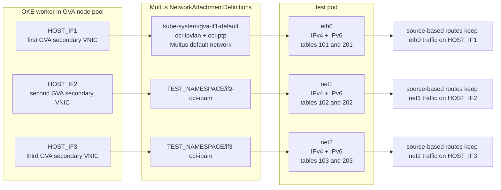

# Dual-Stack OKE GVA Engineer Guide

This guide is for a customer engineer configuring IPv4 and IPv6 dual stack on Oracle Kubernetes Engine (OKE) with Generic VNIC Attachment (GVA), Multus, and `oci-ipam`.

For a copy-paste command version without exported environment variables, see [NO_ENV_COMMANDS.md](NO_ENV_COMMANDS.md).

GVA attaches secondary Virtual Network Interface Cards (VNICs) to OKE worker nodes. Multus attaches VNIC-backed networks to pods. NetworkAttachmentDefinitions (NADs) are the Kubernetes custom resources Multus uses to describe those networks. `oci-ipam` allocates pod IPv4 and IPv6 addresses from OCI-backed interfaces.

This guide creates:

| Item | Result |
|---|---|
| OKE cluster | Enhanced, VCN-native, IPv4 and IPv6 enabled |
| GVA node pool | Two workers, each with three secondary VNICs |
| Secondary VNIC IP request | `ipCount: 16` and `assignIpv6Ip: true` on each secondary VNIC profile |
| Pod default network | `eth0` from the first GVA secondary VNIC |
| Pod additional networks | `net1` and `net2` from the second and third GVA secondary VNICs |
| Pod routing | Source-based IPv4 and IPv6 routing per pod interface |
| Pod IPv4 internet egress | Verified with interface-bound IPv4 `curl` from both test pods |

Interface and routing model:



## Scope

This guide proves pod-to-pod IPv4 and IPv6 connectivity across GVA-backed pod interfaces inside the VCN. It does not prove public IPv6 internet egress, Kubernetes Service dual-stack behavior, DNS A/AAAA behavior, or load balancer behavior. Validate those separately if they are part of the target requirement.

## Prerequisites

- OCI CLI with support for `oci ce cluster create --ip-families`.
- OCI CLI with support for `oci ce node-pool create --secondary-vnics`.
- `kubectl`, `jq`, `envsubst`, and `bash`.
- An IPv6-enabled VCN.
- Distinct dual-stack subnets for the OKE API endpoint, service load balancers, worker primary VNICs, and each GVA secondary VNIC.
- Security lists or network security groups that allow pod-to-pod traffic and IPv4 internet egress from the GVA secondary subnets.
- IAM permissions to manage OKE clusters, node pools, VCN resources, subnets, VNICs, route resources, and security resources.
- Kubernetes permissions to install Multus, create NetworkAttachmentDefinitions (NADs), create namespaces, and run test pods.
- Worker shape capacity for one primary VNIC plus three secondary VNICs.
- An OKE worker image OCID that matches your region, Kubernetes version, architecture, and shape.

## OCI Network Requirements

Before creating the cluster or node pool, confirm:

| Area | Requirement |
|---|---|
| Subnets | API, load balancer, worker primary, and GVA secondary subnets are dual stack. |
| GVA subnet capacity | Each GVA secondary subnet has enough free IPv4 and IPv6 addresses for node VNICs and pod IPs. |
| GVA security | Allow IPv4 ICMP and IPv6 ICMP between all GVA secondary subnet CIDRs, both ingress and egress. |
| Optional app traffic | Allow any TCP or UDP ports required by the workload test. |
| GVA routing | Keep local VCN routing between GVA secondary subnets. No NAT or internet gateway is needed for in-VCN pod-to-pod ping tests. |
| IPv4 internet egress | Route `0.0.0.0/0` from each GVA secondary subnet to a NAT gateway or approved IPv4 egress path, and allow matching IPv4 egress in the security list or NSG. |
| Optional IPv6 public egress | For IPv6, verify `::/0` to the intended IPv6 route target and globally routable IPv6 addressing. |
| API access | The operator network can reach the Kubernetes API endpoint. |
| Worker baseline | Worker primary subnet rules still allow normal OKE control-plane and kubelet traffic. |

## Verify Before Starting

This guide does not pin exact minimum versions for OKE, OCI CLI, `kubectl`, or Multus. Confirm the supported versions for your region before creating resources.

The subnet variables in this guide identify existing subnets consumed by cluster and node-pool creation. This guide does not create the VCN or subnets.

Run these local checks before creating OCI resources:

```sh
oci -v
kubectl version --client
jq --version
envsubst --version | head -n 1
bash --version | head -n 1

oci ce cluster create --help | grep -- --ip-families
oci ce node-pool create --help | grep -- --secondary-vnics
oci ce node-pool create --help | grep -- --cni-type
```

Expected result:

- The installed tools print versions successfully.
- The OCI CLI help includes `--ip-families`, `--secondary-vnics`, and `--cni-type`.

Run the shell blocks in `bash`. Several snippets use bash arrays and indirect variable expansion.

## 1 Set Inputs

Intent

Set every value used by the cluster, node pool, NAD, and routing commands. The VCN must contain separate subnets for the API endpoint, service load balancers, worker primary VNICs, and the three GVA secondary VNICs.

Run

```sh
# OCI region and compartment where the OKE resources are created.
export REGION="<oci_region>"
export COMPARTMENT_OCID="<compartment_ocid>"

# Existing IPv6-enabled VCN that contains all cluster and GVA subnets.
export VCN_OCID="<vcn_ocid>"

# OKE cluster identity and version.
export CLUSTER_NAME="<cluster_name>"
export CLUSTER_CONTEXT="<kubectl_context_name>"
export KUBERNETES_VERSION="<oke_kubernetes_version>"

# API server endpoint subnet. This is the subnet used by the Kubernetes API endpoint.
export ENDPOINT_SUBNET_OCID="<api_endpoint_subnet_ocid>"
export ENDPOINT_PUBLIC_IP_ENABLED="<true_or_false>"

# Subnets used by Kubernetes Service resources of type LoadBalancer.
export SERVICE_LB_SUBNET_1_OCID="<service_lb_subnet_1_ocid>"
export SERVICE_LB_SUBNET_2_OCID="<service_lb_subnet_2_ocid>"

# GVA node-pool settings.
export NODE_POOL_NAME="<gva_node_pool_name>"
export NODE_SHAPE="<worker_shape>"
export NODE_OCPUS="<ocpus_for_flex_shape>"
export NODE_MEMORY_GB="<memory_gb_for_flex_shape>"
export NODE_IMAGE_OCID="<oke_worker_image_ocid>"
export AVAILABILITY_DOMAIN="<availability_domain_name>"
export SSH_PUBLIC_KEY="<ssh_public_key>"

# Worker primary VNIC subnet.
export PRIMARY_NODE_SUBNET_OCID="<worker_primary_subnet_ocid>"

# Secondary VNIC subnets. These back pod eth0, net1, and net2.
export SECONDARY_SUBNET_IF1_OCID="<secondary_subnet_1_ocid>"
export SECONDARY_SUBNET_IF2_OCID="<secondary_subnet_2_ocid>"
export SECONDARY_SUBNET_IF3_OCID="<secondary_subnet_3_ocid>"

# Kubernetes test namespace and node label.
export TEST_NAMESPACE="gva-dualstack-test"
export GVA_NODEPOOL_LABEL="gva-dualstack"

# Host interface names for the three GVA secondary VNICs.
# Verify these after the GVA nodes join the cluster.
export HOST_IF1="enp1s0"
export HOST_IF2="enp2s0"
export HOST_IF3="enp3s0"

# IPv4 and IPv6 subnet CIDRs plus IPv4 default gateways used by pod routing.
export IF1_IPV4_CIDR="<secondary_subnet_1_ipv4_cidr>"
export IF2_IPV4_CIDR="<secondary_subnet_2_ipv4_cidr>"
export IF3_IPV4_CIDR="<secondary_subnet_3_ipv4_cidr>"
export IF1_IPV4_GW="<secondary_subnet_1_ipv4_default_gateway>"
export IF2_IPV4_GW="<secondary_subnet_2_ipv4_default_gateway>"
export IF3_IPV4_GW="<secondary_subnet_3_ipv4_default_gateway>"
export IF1_IPV6_CIDR="<secondary_subnet_1_ipv6_cidr>"
export IF2_IPV6_CIDR="<secondary_subnet_2_ipv6_cidr>"
export IF3_IPV6_CIDR="<secondary_subnet_3_ipv6_cidr>"

# Fail before creating resources if any required input is unset or still a placeholder.
required_vars=(
  REGION COMPARTMENT_OCID VCN_OCID CLUSTER_NAME CLUSTER_CONTEXT KUBERNETES_VERSION
  ENDPOINT_SUBNET_OCID ENDPOINT_PUBLIC_IP_ENABLED SERVICE_LB_SUBNET_1_OCID SERVICE_LB_SUBNET_2_OCID
  NODE_POOL_NAME NODE_SHAPE NODE_OCPUS NODE_MEMORY_GB NODE_IMAGE_OCID AVAILABILITY_DOMAIN SSH_PUBLIC_KEY
  PRIMARY_NODE_SUBNET_OCID SECONDARY_SUBNET_IF1_OCID SECONDARY_SUBNET_IF2_OCID SECONDARY_SUBNET_IF3_OCID
  TEST_NAMESPACE GVA_NODEPOOL_LABEL HOST_IF1 HOST_IF2 HOST_IF3
  IF1_IPV4_CIDR IF2_IPV4_CIDR IF3_IPV4_CIDR IF1_IPV4_GW IF2_IPV4_GW IF3_IPV4_GW
  IF1_IPV6_CIDR IF2_IPV6_CIDR IF3_IPV6_CIDR
)

for var in "${required_vars[@]}"; do
  value="${!var:-}"
  if [ -z "$value" ] || printf '%s' "$value" | grep -q '^<.*>$'; then
    echo "Set $var before continuing" >&2
    exit 1
  fi
done
```

Expected result

- Every variable is set.
- The API endpoint, load balancer, worker primary VNIC, and GVA secondary VNIC subnets are distinct unless your network design intentionally shares a subnet role.
- Each selected subnet has an IPv4 CIDR and an IPv6 CIDR.
- The selected worker shape supports three secondary VNICs.
- The preflight loop exits cleanly before any OCI resource is created.

## 2 Create Cluster JSON Inputs

Intent

Create local JSON files used by the OCI CLI cluster create command.

Run

```sh
# Store generated OCI CLI JSON inputs in one local directory.
mkdir -p generated/dualstack-gva

# Tell OKE to use OCI VCN-native pod networking.
cat > generated/dualstack-gva/cluster-pod-network-options.json <<'EOF'
[
  {
    "cniType": "OCI_VCN_IP_NATIVE"
  }
]
EOF

# Tell OKE to enable both IPv4 and IPv6 for the cluster.
cat > generated/dualstack-gva/ip-families.json <<'EOF'
[
  "IPv4",
  "IPv6"
]
EOF

# Tell OKE which subnets to use for Kubernetes Service type LoadBalancer.
cat > generated/dualstack-gva/service-lb-subnet-ids.json <<EOF
[
  "${SERVICE_LB_SUBNET_1_OCID}",
  "${SERVICE_LB_SUBNET_2_OCID}"
]
EOF

# Validation only. These commands parse JSON and create no OCI resources.
jq empty generated/dualstack-gva/cluster-pod-network-options.json
jq empty generated/dualstack-gva/ip-families.json
jq empty generated/dualstack-gva/service-lb-subnet-ids.json
```

Expected result

- All three `jq empty` commands exit with status `0`.
- The files exist under `generated/dualstack-gva/`.

## 3 Create The Dual-Stack Cluster

Intent

Create an enhanced OKE cluster using VCN-native pod networking and both IP families. The `--endpoint-subnet-id` value defines the subnet used by the Kubernetes API server endpoint.

Run

```sh
# Create a rendered cluster-create script with the current variable values filled in.
cat > generated/dualstack-gva/create-cluster.sh <<EOF
#!/usr/bin/env bash
set -euo pipefail

oci ce cluster create \\
  --region "${REGION}" \\
  --compartment-id "${COMPARTMENT_OCID}" \\
  --name "${CLUSTER_NAME}" \\
  --vcn-id "${VCN_OCID}" \\
  --kubernetes-version "${KUBERNETES_VERSION}" \\
  --type ENHANCED_CLUSTER \\
  --cluster-pod-network-options "file://$(pwd)/generated/dualstack-gva/cluster-pod-network-options.json" \\
  --ip-families "file://$(pwd)/generated/dualstack-gva/ip-families.json" \\
  --endpoint-subnet-id "${ENDPOINT_SUBNET_OCID}" \\
  --endpoint-public-ip-enabled "${ENDPOINT_PUBLIC_IP_ENABLED}" \\
  --service-lb-subnet-ids "file://$(pwd)/generated/dualstack-gva/service-lb-subnet-ids.json" \\
  --output json
EOF

chmod +x generated/dualstack-gva/create-cluster.sh

# Inspect the rendered command before creating the cluster.
sed -n '1,40p' generated/dualstack-gva/create-cluster.sh

# Create the OKE control plane with dual-stack IPv4 and IPv6 enabled.
bash generated/dualstack-gva/create-cluster.sh
```

Expected result

- The command returns an `opc-work-request-id`.
- The work request succeeds.
- `generated/dualstack-gva/create-cluster.sh` contains the actual values from your environment, not unresolved shell variables.

Confirm

```sh
# Replace the placeholder with the work request OCID returned by cluster create.
oci ce work-request get \
  --region "$REGION" \
  --work-request-id <work_request_ocid> \
  --output json \
  | jq '.data | {status, resources, errors}'

# Set the cluster OCID returned by the work request or cluster list.
export CLUSTER_OCID="<created_cluster_ocid>"

# Confirm the cluster is active and dual stack.
oci ce cluster get \
  --region "$REGION" \
  --cluster-id "$CLUSTER_OCID" \
  --output json \
  | jq '.data | {
      name,
      lifecycleState: ."lifecycle-state",
      type,
      clusterPodNetworkOptions: ."cluster-pod-network-options",
      ipFamilies: ."ip-families"
    }'
```

Expected values

- `status` is `SUCCEEDED`.
- `lifecycleState` is `ACTIVE`.
- `type` is `ENHANCED_CLUSTER`.
- `clusterPodNetworkOptions` includes `OCI_VCN_IP_NATIVE`.
- `ipFamilies` includes `IPv4` and `IPv6`.

## 4 Configure Kubectl

Intent

Create kubeconfig access to the new cluster and verify that `kubectl` reaches the API server.

Run

```sh
# Create or update kubeconfig for the new OKE cluster.
oci ce cluster create-kubeconfig \
  --cluster-id "$CLUSTER_OCID" \
  --file "$HOME/.kube/config" \
  --region "$REGION" \
  --token-version 2.0.0 \
  --kube-endpoint "<PUBLIC_ENDPOINT_or_PRIVATE_ENDPOINT>"

# Select the expected kubectl context.
kubectl config use-context "$CLUSTER_CONTEXT"

# Confirm kubectl can reach the API server.
kubectl cluster-info
```

Expected result

- `kubectl config current-context` returns `$CLUSTER_CONTEXT`.
- `kubectl cluster-info` returns the Kubernetes control plane endpoint.

## 5 Prepare The Secondary VNIC Payload

Intent

Prepare the JSON input that the node-pool create command uses to create secondary VNICs. This step creates only a local payload file. OKE creates and attaches the secondary VNICs during node-pool creation.

Each profile requests 16 IPv4 addresses and requests IPv6 assignment for the secondary VNIC. The payload intentionally omits `applicationResources`; the NADs in this guide select interfaces by `deviceSelector.interfaceName`.

Run

```sh
# Define three secondary VNIC profiles, one for each GVA-backed pod interface.
cat > generated/dualstack-gva/secondary-vnics.json <<EOF
[
  {
    "displayName": "vnicattachment-gva-if1",
    "createVnicDetails": {
      "displayName": "vnic-gva-if1",
      "subnetId": "${SECONDARY_SUBNET_IF1_OCID}",
      "assignPublicIp": false,
      "assignIpv6Ip": true,
      "skipSourceDestCheck": false,
      "ipCount": 16
    }
  },
  {
    "displayName": "vnicattachment-gva-if2",
    "createVnicDetails": {
      "displayName": "vnic-gva-if2",
      "subnetId": "${SECONDARY_SUBNET_IF2_OCID}",
      "assignPublicIp": false,
      "assignIpv6Ip": true,
      "skipSourceDestCheck": false,
      "ipCount": 16
    }
  },
  {
    "displayName": "vnicattachment-gva-if3",
    "createVnicDetails": {
      "displayName": "vnic-gva-if3",
      "subnetId": "${SECONDARY_SUBNET_IF3_OCID}",
      "assignPublicIp": false,
      "assignIpv6Ip": true,
      "skipSourceDestCheck": false,
      "ipCount": 16
    }
  }
]
EOF

# Validation only. This command parses JSON and creates no OCI resources or VNICs.
jq empty generated/dualstack-gva/secondary-vnics.json
```

Expected result

- `jq empty` exits with status `0`.
- Each profile has `ipCount: 16`.
- Each profile has `assignIpv6Ip: true`.
- No `applicationResources` field is present.

## 6 Create The GVA Node Pool

Intent

Create a two-node worker pool. During this operation, OKE creates each worker node, attaches the primary VNIC, and creates and attaches the three GVA secondary VNICs from `secondary-vnics.json`.

Run

```sh
# Create a rendered node-pool create script with the current variable values filled in.
cat > generated/dualstack-gva/create-node-pool.sh <<EOF
#!/usr/bin/env bash
set -euo pipefail

oci ce node-pool create \\
  --region "${REGION}" \\
  --compartment-id "${COMPARTMENT_OCID}" \\
  --cluster-id "${CLUSTER_OCID}" \\
  --name "${NODE_POOL_NAME}" \\
  --kubernetes-version "${KUBERNETES_VERSION}" \\
  --node-shape "${NODE_SHAPE}" \\
  --node-shape-config "{\\"ocpus\\":${NODE_OCPUS},\\"memoryInGBs\\":${NODE_MEMORY_GB}}" \\
  --size 2 \\
  --cni-type OCI_VCN_IP_NATIVE \\
  --placement-configs "[{\\"availabilityDomain\\":\\"${AVAILABILITY_DOMAIN}\\",\\"subnetId\\":\\"${PRIMARY_NODE_SUBNET_OCID}\\"}]" \\
  --node-source-details "{\\"sourceType\\":\\"IMAGE\\",\\"imageId\\":\\"${NODE_IMAGE_OCID}\\"}" \\
  --initial-node-labels "[{\\"key\\":\\"network\\",\\"value\\":\\"${GVA_NODEPOOL_LABEL}\\"},{\\"key\\":\\"gva.oraclecloud.com/secondary-vnics\\",\\"value\\":\\"3\\"}]" \\
  --ssh-public-key "${SSH_PUBLIC_KEY}" \\
  --secondary-vnics "file://$(pwd)/generated/dualstack-gva/secondary-vnics.json" \\
  --output json
EOF

chmod +x generated/dualstack-gva/create-node-pool.sh

# Inspect the rendered command before creating the node pool.
sed -n '1,60p' generated/dualstack-gva/create-node-pool.sh

# Create the GVA node pool. OKE creates and attaches the secondary VNICs from the JSON payload.
bash generated/dualstack-gva/create-node-pool.sh
```

Expected result

- The command returns an `opc-work-request-id`.
- The work request succeeds.
- Two GVA workers join the cluster.
- Each GVA worker has three secondary VNICs created from the node-pool request.
- `generated/dualstack-gva/create-node-pool.sh` contains the actual values from your environment, not unresolved shell variables.

Confirm

```sh
# Replace the placeholder with the node-pool work request OCID returned by node-pool create.
export NODE_POOL_WORK_REQUEST_OCID="<node_pool_work_request_ocid>"

# Confirm the asynchronous node-pool create operation completed.
oci ce work-request get \
  --region "$REGION" \
  --work-request-id "$NODE_POOL_WORK_REQUEST_OCID" \
  --output json \
  | jq '.data | {status, resources, errors}'

# Set this to the created node-pool OCID from the work request or node-pool list.
export NODE_POOL_OCID="<created_node_pool_ocid>"

# Confirm the node pool is active and tied to the expected cluster.
oci ce node-pool get \
  --region "$REGION" \
  --node-pool-id "$NODE_POOL_OCID" \
  --output json \
  | jq '.data | {
      name,
      lifecycleState: ."lifecycle-state",
      clusterId: ."cluster-id",
      size,
      kubernetesVersion: ."kubernetes-version",
      nodeShape: ."node-shape",
      subnetIds: (."node-subnet-ids" // [])
    }'

# Confirm the GVA node-pool workers are Ready.
kubectl get nodes -l "network=${GVA_NODEPOOL_LABEL}" -o wide

# Confirm Kubernetes sees two Ready workers with IPv4 and, when the primary subnet is dual stack, IPv6 InternalIP values.
kubectl get nodes -l "network=${GVA_NODEPOOL_LABEL}" -o json \
  | jq -r '
      .items[] |
      .metadata.name as $node |
      [.status.conditions[] | select(.type == "Ready") | .status][0] as $ready |
      [.status.addresses[] | select(.type == "InternalIP") | .address] as $ips |
      [$node, $ready, ($ips | join(","))] | @tsv'

# Optional OCI-side check from the repository helper.
python3 get_node_ips.py --node-pool-id "$NODE_POOL_OCID" --format table
```

Expected result

- Two nodes are listed.
- Both nodes are `Ready`.
- The node-pool work request is `SUCCEEDED`.
- `oci ce node-pool get` returns the expected node pool, shape, size, and cluster ID.
- The optional `get_node_ips.py` check shows the primary and secondary VNIC/IP state for the node pool.

## 7 Install Multus

Intent

Install Multus so pods can use the GVA-backed networks.

Run

```sh
# Install the Multus thick-plugin daemonset.
kubectl apply -f https://raw.githubusercontent.com/k8snetworkplumbingwg/multus-cni/master/deployments/multus-daemonset-thick.yml

# Wait until the Multus daemonset is available.
kubectl -n kube-system rollout status ds/kube-multus-ds --timeout=180s

# Confirm the NAD custom resource definition exists.
kubectl get crd network-attachment-definitions.k8s.cni.cncf.io
```

Expected result

- The Multus daemonset rollout completes.
- The NAD CRD exists.

## 8 Create NetworkAttachmentDefinitions

Intent

Create one default-network NAD for pod `eth0` and two additional NADs for pod `net1` and `net2`.

The default-network NAD in `kube-system` chains `oci-ipvlan` and `oci-ptp` and attaches pod `eth0` to the first GVA-backed host interface. The two namespaced NADs attach pod `net1` and `net2` to the second and third GVA-backed host interfaces with `ipvlan` and `oci-ipam`.

Preferred interface discovery

If you are running this guide from this repository, generate the NADs from one joined GVA worker node. This avoids assuming that the secondary interfaces are always named `enp1s0`, `enp2s0`, and `enp3s0`.

```sh
# Pick one Ready GVA worker.
GVA_NODE="$(kubectl get nodes -l "network=${GVA_NODEPOOL_LABEL}" -o jsonpath='{.items[0].metadata.name}')"

# Discover three secondary host interfaces and generate the NAD manifest.
bash scripts/generate_nads_from_node.sh \
  --node "$GVA_NODE" \
  --namespace "$TEST_NAMESPACE" \
  --default-name gva-if1-default \
  --nad-prefix if \
  --count 3 \
  --output generated/dualstack-gva/nads.yaml
```

Expected result

- The script prints the discovered mapping from pod interfaces to host interfaces.
- `generated/dualstack-gva/nads.yaml` contains one default NAD and two additional NADs.

Manual fallback

Run

```sh
# Create the test namespace and three NetworkAttachmentDefinitions.
# Use this manual fallback only after HOST_IF1, HOST_IF2, and HOST_IF3 have been verified.
cat > generated/dualstack-gva/nads.yaml <<EOF
apiVersion: v1
kind: Namespace
metadata:
  name: ${TEST_NAMESPACE}
---
apiVersion: k8s.cni.cncf.io/v1
kind: NetworkAttachmentDefinition
metadata:
  name: gva-if1-default
  namespace: kube-system
spec:
  config: |
    {
      "name": "gva-if1-default",
      "cniVersion": "0.3.1",
      "plugins": [
        {
          "cniVersion": "0.3.1",
          "type": "oci-ipvlan",
          "mode": "l2",
          "ipam": {
            "type": "oci-ipam",
            "deviceSelector": {
              "interfaceName": "${HOST_IF1}"
            }
          }
        },
        {
          "cniVersion": "0.3.1",
          "type": "oci-ptp",
          "containerInterface": "ptp-veth0",
          "mtu": 9000
        }
      ]
    }
---
apiVersion: k8s.cni.cncf.io/v1
kind: NetworkAttachmentDefinition
metadata:
  name: if2-oci-ipam
  namespace: ${TEST_NAMESPACE}
spec:
  config: |
    {
      "cniVersion": "0.3.1",
      "type": "ipvlan",
      "mode": "l2",
      "master": "${HOST_IF2}",
      "ipam": {
        "type": "oci-ipam",
        "deviceSelector": {
          "interfaceName": "${HOST_IF2}"
        }
      }
    }
---
apiVersion: k8s.cni.cncf.io/v1
kind: NetworkAttachmentDefinition
metadata:
  name: if3-oci-ipam
  namespace: ${TEST_NAMESPACE}
spec:
  config: |
    {
      "cniVersion": "0.3.1",
      "type": "ipvlan",
      "mode": "l2",
      "master": "${HOST_IF3}",
      "ipam": {
        "type": "oci-ipam",
        "deviceSelector": {
          "interfaceName": "${HOST_IF3}"
        }
      }
    }
EOF

# Create the namespace first so server-side dry run can validate namespaced NADs.
kubectl create namespace "$TEST_NAMESPACE" --dry-run=client -o yaml | kubectl apply -f -

# Validation only. This checks the manifest against the cluster API without creating or changing NADs.
kubectl apply --dry-run=server -f generated/dualstack-gva/nads.yaml

# Create the namespace and NADs.
kubectl apply -f generated/dualstack-gva/nads.yaml

# Confirm the default NAD and workload NADs exist.
kubectl -n kube-system get network-attachment-definitions gva-if1-default
kubectl -n "$TEST_NAMESPACE" get network-attachment-definitions
```

Expected result

- The namespace exists.
- Server-side dry run succeeds.
- `gva-if1-default` exists in `kube-system`.
- `if2-oci-ipam` and `if3-oci-ipam` exist in `$TEST_NAMESPACE`.

If your worker image uses different secondary host interface names, set `HOST_IF1`, `HOST_IF2`, and `HOST_IF3` to the discovered names before using the manual fallback.

## 9 Create Test Pods With Routing

Intent

Create a test pod that receives IPv4 and IPv6 addresses on `eth0`, `net1`, and `net2`, then configures source-based policy routing for each interface.

Routing is necessary because Linux normally selects routes by destination, not by the interface that owns the source address. In a multihomed GVA pod, `eth0`, `net1`, and `net2` are backed by different OCI VNIC paths and subnets. Without `ip rule from <source-ip> table <table>` entries, traffic sourced from `net1` or `net2` can still leave through the default route for another interface, which can break return traffic, ping tests, IPv4 internet egress, and application flows that expect symmetric interface use.

The IPv4 default routes in tables `101`, `102`, and `103` are intentional. They send internet-bound IPv4 traffic through the gateway for the subnet that owns the selected source address; the OCI route table for that GVA subnet then forwards `0.0.0.0/0` to the NAT gateway or approved IPv4 egress path.

Run

```sh
# Create a routed multihomed test pod.
cat > generated/dualstack-gva/pod-a.yaml <<'EOF'
apiVersion: v1
kind: Pod
metadata:
  name: gva-dualstack-a
  namespace: ${TEST_NAMESPACE}
  labels:
    app: gva-dualstack-test
  annotations:
    v1.multus-cni.io/default-network: kube-system/gva-if1-default
    k8s.v1.cni.cncf.io/networks: |
      [
        {"name":"if2-oci-ipam","namespace":"${TEST_NAMESPACE}","interface":"net1"},
        {"name":"if3-oci-ipam","namespace":"${TEST_NAMESPACE}","interface":"net2"}
      ]
spec:
  restartPolicy: Always
  nodeSelector:
    network: ${GVA_NODEPOOL_LABEL}
  affinity:
    podAntiAffinity:
      requiredDuringSchedulingIgnoredDuringExecution:
        - labelSelector:
            matchLabels:
              app: gva-dualstack-test
          topologyKey: kubernetes.io/hostname
  containers:
    - name: netshoot
      image: docker.io/nicolaka/netshoot:v0.13
      securityContext:
        allowPrivilegeEscalation: false
        capabilities:
          add:
            - NET_ADMIN
      env:
        - name: IF1_IPV4_CIDR
          value: "${IF1_IPV4_CIDR}"
        - name: IF2_IPV4_CIDR
          value: "${IF2_IPV4_CIDR}"
        - name: IF3_IPV4_CIDR
          value: "${IF3_IPV4_CIDR}"
        - name: IF1_IPV4_GW
          value: "${IF1_IPV4_GW}"
        - name: IF2_IPV4_GW
          value: "${IF2_IPV4_GW}"
        - name: IF3_IPV4_GW
          value: "${IF3_IPV4_GW}"
        - name: IF1_IPV6_CIDR
          value: "${IF1_IPV6_CIDR}"
        - name: IF2_IPV6_CIDR
          value: "${IF2_IPV6_CIDR}"
        - name: IF3_IPV6_CIDR
          value: "${IF3_IPV6_CIDR}"
      command:
        - /bin/sh
        - -lc
        - |
          configure_iface() {
            iface="$1"
            table4="$2"
            prio4="$3"
            subnet4="$4"
            gw4="$5"
            table6="$6"
            prio6="$7"
            subnet6="$8"

            ip4="$(ip -4 -o addr show dev "${iface}" | awk '{split($4,a,"/"); print a[1]; exit}')"
            if [ -n "${ip4}" ]; then
              ip route replace default via "${gw4}" dev "${iface}" table "${table4}" || true
              ip route replace "${subnet4}" dev "${iface}" src "${ip4}" table "${table4}" || true
              ip rule add from "${ip4}/32" table "${table4}" priority "${prio4}" 2>/dev/null || true
            fi

            ip6="$(ip -6 -o addr show dev "${iface}" scope global | awk '{split($4,a,"/"); print a[1]; exit}')"
            if [ -n "${ip6}" ]; then
              ip -6 route replace "${subnet6}" dev "${iface}" src "${ip6}" table "${table6}" || true
              gw6="$(ip -6 route show default dev "${iface}" | awk '/ via / {print $3; exit}')"
              if [ -n "${gw6}" ]; then
                ip -6 route replace default via "${gw6}" dev "${iface}" table "${table6}" || true
              fi
              ip -6 rule add from "${ip6}/128" table "${table6}" priority "${prio6}" 2>/dev/null || true
            fi
          }

          configure_iface eth0 101 101 "$IF1_IPV4_CIDR" "$IF1_IPV4_GW" 201 201 "$IF1_IPV6_CIDR"
          configure_iface net1 102 102 "$IF2_IPV4_CIDR" "$IF2_IPV4_GW" 202 202 "$IF2_IPV6_CIDR"
          configure_iface net2 103 103 "$IF3_IPV4_CIDR" "$IF3_IPV4_GW" 203 203 "$IF3_IPV6_CIDR"

          ip -br addr
          ip rule
          ip -6 rule
          sleep infinity
EOF

# Render only the documented guide inputs. Local shell variables used by the pod startup function remain literal.
envsubst '${TEST_NAMESPACE} ${GVA_NODEPOOL_LABEL} ${IF1_IPV4_CIDR} ${IF2_IPV4_CIDR} ${IF3_IPV4_CIDR} ${IF1_IPV4_GW} ${IF2_IPV4_GW} ${IF3_IPV4_GW} ${IF1_IPV6_CIDR} ${IF2_IPV6_CIDR} ${IF3_IPV6_CIDR}' \
  < generated/dualstack-gva/pod-a.yaml > generated/dualstack-gva/pod-a.rendered.yaml

# Create a second pod by changing only the pod name.
sed 's/name: gva-dualstack-a/name: gva-dualstack-b/' \
  generated/dualstack-gva/pod-a.rendered.yaml > generated/dualstack-gva/pod-b.rendered.yaml

# Validate the pod manifests against the cluster API without creating pods.
kubectl apply --dry-run=server -f generated/dualstack-gva/pod-a.rendered.yaml
kubectl apply --dry-run=server -f generated/dualstack-gva/pod-b.rendered.yaml

# Create both test pods.
kubectl apply -f generated/dualstack-gva/pod-a.rendered.yaml
kubectl apply -f generated/dualstack-gva/pod-b.rendered.yaml

# Wait for both pods to run.
kubectl -n "$TEST_NAMESPACE" wait --for=condition=Ready pod/gva-dualstack-a --timeout=180s
kubectl -n "$TEST_NAMESPACE" wait --for=condition=Ready pod/gva-dualstack-b --timeout=180s
```

Expected result

- Both server-side dry-run commands succeed.
- Both pods become `Ready`.
- The two pods schedule on different nodes when two labeled GVA workers are available.
- Each pod has `NET_ADMIN` so it can install Linux policy routes.

Routing table mapping

| Pod interface | IPv4 table | IPv4 rule priority | IPv6 table | IPv6 rule priority |
|---|---:|---:|---:|---:|
| `eth0` | `101` | `101` | `201` | `201` |
| `net1` | `102` | `102` | `202` | `202` |
| `net2` | `103` | `103` | `203` | `203` |

## 10 Verify Dual Stack

Intent

Prove that OKE, Multus, `oci-ipam`, and pod routing are working for both IPv4 and IPv6.

Run

```sh
# Confirm both pods are running and see the assigned node.
kubectl -n "$TEST_NAMESPACE" get pods -o wide

# Confirm Multus attached all requested networks.
kubectl -n "$TEST_NAMESPACE" get pod gva-dualstack-a \
  -o jsonpath='{.metadata.annotations.k8s\.v1\.cni\.cncf\.io/network-status}{"\n"}'

# Confirm IPv4 and IPv6 addresses exist on eth0, net1, and net2.
kubectl -n "$TEST_NAMESPACE" exec gva-dualstack-a -- ip -br addr
kubectl -n "$TEST_NAMESPACE" exec gva-dualstack-b -- ip -br addr

# Confirm IPv4 and IPv6 source rules exist.
kubectl -n "$TEST_NAMESPACE" exec gva-dualstack-a -- ip rule
kubectl -n "$TEST_NAMESPACE" exec gva-dualstack-a -- ip -6 rule

# Confirm per-interface route tables exist.
for table in 101 102 103; do
  kubectl -n "$TEST_NAMESPACE" exec gva-dualstack-a -- ip route show table "$table"
done

for table in 201 202 203; do
  kubectl -n "$TEST_NAMESPACE" exec gva-dualstack-a -- ip -6 route show table "$table"
done

# Confirm IPv4 internet egress from each interface in both pods.
for pod in gva-dualstack-a gva-dualstack-b; do
  for iface in eth0 net1 net2; do
    printf '%s %s egress IPv4: ' "$pod" "$iface"
    kubectl -n "$TEST_NAMESPACE" exec "$pod" -- curl -4 --interface "$iface" -fsS https://ifconfig.me/ip
    printf '\n'
  done
done
```

Expected result

- `network-status` includes `eth0`, `net1`, and `net2`.
- `eth0`, `net1`, and `net2` each have an IPv4 address.
- `eth0`, `net1`, and `net2` each have a global IPv6 address.
- IPv4 rules exist for priorities `101`, `102`, and `103`.
- IPv6 rules exist for priorities `201`, `202`, and `203`.
- Each pod/interface pair returns the IPv4 address seen by the internet egress path.

Extract the pod interface addresses from the Multus `network-status` annotations.

```sh
pod_ip() {
  pod="$1"
  iface="$2"
  family="$3"

  kubectl -n "$TEST_NAMESPACE" get pod "$pod" -o json \
    | jq -r --arg iface "$iface" --arg family "$family" '
        (.metadata.annotations["k8s.v1.cni.cncf.io/network-status"] | fromjson)[]
        | select(.interface == $iface)
        | (.ips // [])[]
        | select(if $family == "ipv6" then contains(":") else (contains(":") | not) end)
      ' \
    | head -n 1
}

POD_A_ETH0_IPV4="$(pod_ip gva-dualstack-a eth0 ipv4)"
POD_A_NET1_IPV4="$(pod_ip gva-dualstack-a net1 ipv4)"
POD_A_NET2_IPV4="$(pod_ip gva-dualstack-a net2 ipv4)"
POD_A_ETH0_IPV6="$(pod_ip gva-dualstack-a eth0 ipv6)"
POD_A_NET1_IPV6="$(pod_ip gva-dualstack-a net1 ipv6)"
POD_A_NET2_IPV6="$(pod_ip gva-dualstack-a net2 ipv6)"

POD_B_ETH0_IPV4="$(pod_ip gva-dualstack-b eth0 ipv4)"
POD_B_NET1_IPV4="$(pod_ip gva-dualstack-b net1 ipv4)"
POD_B_NET2_IPV4="$(pod_ip gva-dualstack-b net2 ipv4)"
POD_B_ETH0_IPV6="$(pod_ip gva-dualstack-b eth0 ipv6)"
POD_B_NET1_IPV6="$(pod_ip gva-dualstack-b net1 ipv6)"
POD_B_NET2_IPV6="$(pod_ip gva-dualstack-b net2 ipv6)"

for var in \
  POD_A_ETH0_IPV4 POD_A_NET1_IPV4 POD_A_NET2_IPV4 \
  POD_A_ETH0_IPV6 POD_A_NET1_IPV6 POD_A_NET2_IPV6 \
  POD_B_ETH0_IPV4 POD_B_NET1_IPV4 POD_B_NET2_IPV4 \
  POD_B_ETH0_IPV6 POD_B_NET1_IPV6 POD_B_NET2_IPV6; do
  if [ -z "${!var}" ]; then
    echo "Missing $var from network-status" >&2
    exit 1
  fi
  printf '%s=%s\n' "$var" "${!var}"
done
```

Run connectivity tests with the extracted addresses.

```sh
# IPv4 interface-bound tests from pod A to pod B.
kubectl -n "$TEST_NAMESPACE" exec gva-dualstack-a -- ping -4 -I eth0 -c 2 -W 2 "$POD_B_ETH0_IPV4"
kubectl -n "$TEST_NAMESPACE" exec gva-dualstack-a -- ping -4 -I net1 -c 2 -W 2 "$POD_B_NET1_IPV4"
kubectl -n "$TEST_NAMESPACE" exec gva-dualstack-a -- ping -4 -I net2 -c 2 -W 2 "$POD_B_NET2_IPV4"

# IPv6 interface-bound tests from pod A to pod B.
kubectl -n "$TEST_NAMESPACE" exec gva-dualstack-a -- ping -6 -I eth0 -c 2 -W 2 "$POD_B_ETH0_IPV6"
kubectl -n "$TEST_NAMESPACE" exec gva-dualstack-a -- ping -6 -I net1 -c 2 -W 2 "$POD_B_NET1_IPV6"
kubectl -n "$TEST_NAMESPACE" exec gva-dualstack-a -- ping -6 -I net2 -c 2 -W 2 "$POD_B_NET2_IPV6"

# IPv4 interface-bound tests from pod B to pod A.
kubectl -n "$TEST_NAMESPACE" exec gva-dualstack-b -- ping -4 -I eth0 -c 2 -W 2 "$POD_A_ETH0_IPV4"
kubectl -n "$TEST_NAMESPACE" exec gva-dualstack-b -- ping -4 -I net1 -c 2 -W 2 "$POD_A_NET1_IPV4"
kubectl -n "$TEST_NAMESPACE" exec gva-dualstack-b -- ping -4 -I net2 -c 2 -W 2 "$POD_A_NET2_IPV4"

# IPv6 interface-bound tests from pod B to pod A.
kubectl -n "$TEST_NAMESPACE" exec gva-dualstack-b -- ping -6 -I eth0 -c 2 -W 2 "$POD_A_ETH0_IPV6"
kubectl -n "$TEST_NAMESPACE" exec gva-dualstack-b -- ping -6 -I net1 -c 2 -W 2 "$POD_A_NET1_IPV6"
kubectl -n "$TEST_NAMESPACE" exec gva-dualstack-b -- ping -6 -I net2 -c 2 -W 2 "$POD_A_NET2_IPV6"
```

Expected result

- All IPv4 pings return `0% packet loss`.
- All IPv6 pings return `0% packet loss`.
- Both pod A to pod B and pod B to pod A directions pass.

## What This Proves

The verification above proves these behaviors for the tested cluster and VCN:

- The OKE cluster was created with both IPv4 and IPv6 enabled.
- The GVA node pool can attach three secondary VNIC-backed interfaces per worker.
- `oci-ipam` can allocate IPv4 and IPv6 addresses to pod `eth0`, `net1`, and `net2`.
- Source-based routing keeps interface-bound IPv4 and IPv6 pod traffic on the intended pod interface.
- Pod-to-pod connectivity works across each tested GVA-backed subnet for both address families.

These tests do not prove public IPv6 internet egress, Kubernetes Service dual-stack behavior, DNS A/AAAA behavior, or load balancer behavior. Validate those separately if they are part of the customer requirement.

## Cleanup

Delete test pods and NADs when the validation is complete.

```sh
kubectl delete -f generated/dualstack-gva/pod-a.rendered.yaml --ignore-not-found
kubectl delete -f generated/dualstack-gva/pod-b.rendered.yaml --ignore-not-found
kubectl delete -f generated/dualstack-gva/nads.yaml --ignore-not-found
```

Delete Multus only if no other workloads on the cluster depend on it.

```sh
kubectl delete -f https://raw.githubusercontent.com/k8snetworkplumbingwg/multus-cni/master/deployments/multus-daemonset-thick.yml
```

Delete the GVA node pool only after the test pods and NADs are removed. This is destructive. Confirm the target before deleting it.

```sh
oci ce node-pool get \
  --region "$REGION" \
  --node-pool-id "$NODE_POOL_OCID" \
  --output json \
  | jq '.data | {name, id, lifecycleState: ."lifecycle-state", clusterId: ."cluster-id"}'

printf 'Type DELETE-NODE-POOL to delete node pool %s: ' "$NODE_POOL_OCID"
read -r CONFIRM_NODE_POOL_DELETE

if [ "$CONFIRM_NODE_POOL_DELETE" = "DELETE-NODE-POOL" ]; then
  oci ce node-pool delete \
    --region "$REGION" \
    --node-pool-id "$NODE_POOL_OCID" \
    --force
else
  echo "Skipped node-pool deletion"
fi
```

Delete the cluster only if this was a disposable validation cluster. This is destructive. Confirm the target before deleting it.

```sh
oci ce cluster get \
  --region "$REGION" \
  --cluster-id "$CLUSTER_OCID" \
  --output json \
  | jq '.data | {name, id, lifecycleState: ."lifecycle-state", kubernetesVersion: ."kubernetes-version"}'

printf 'Type DELETE-CLUSTER to delete cluster %s: ' "$CLUSTER_OCID"
read -r CONFIRM_CLUSTER_DELETE

if [ "$CONFIRM_CLUSTER_DELETE" = "DELETE-CLUSTER" ]; then
  oci ce cluster delete \
    --region "$REGION" \
    --cluster-id "$CLUSTER_OCID" \
    --force
else
  echo "Skipped cluster deletion"
fi
```

Remove local generated files after the OCI and Kubernetes resources are no longer needed.

```sh
rm -rf generated/dualstack-gva
```

## Evidence To Capture

Capture these outputs for handoff or review. Redact tenancy-specific values if the output will leave the customer environment.

- Tool versions and OCI CLI feature checks from `Verify Before Starting`.
- `oci ce cluster get` output showing `ENHANCED_CLUSTER`, `OCI_VCN_IP_NATIVE`, and both IP families.
- `oci ce node-pool get` output for the GVA node pool.
- `python3 get_node_ips.py --node-pool-id "$NODE_POOL_OCID" --format table` output if the helper is available.
- `generated/dualstack-gva/secondary-vnics.json`.
- `generated/dualstack-gva/nads.yaml`.
- `kubectl -n "$TEST_NAMESPACE" get pods -o wide`.
- Pod `network-status` annotation output for both test pods.
- `ip -br addr`, `ip rule`, `ip -6 rule`, and route table output from the verification section.
- All IPv4 and IPv6 ping command output in both directions.

Do not capture private keys, kubeconfig content, OCI security tokens, or other credentials.

## Troubleshooting

`oci ce cluster create` does not accept `--ip-families`

Upgrade OCI CLI and confirm the OKE API in your region supports dual-stack cluster creation.

`kubectl` fails because the OCI exec credential cannot authenticate

Confirm the intended OCI profile and authentication mode, then update the kubeconfig exec environment if required:

```sh
kubectl config set-credentials <kubeconfig_user_name> \
  --exec-env=OCI_CLI_PROFILE=<profile_name> \
  --exec-env=OCI_CLI_AUTH=<auth_mode>
```

Node-pool creation fails with `Cannot provide podSubnets, podNsgIds, or maxPodsPerNode with secondaryVnics`

Remove pod subnet IDs, pod NSG IDs, and max-pods flags from the node-pool create command when using this GVA secondary VNIC shape.

Pods receive IPv4 addresses but not IPv6 addresses

Verify the cluster was created with both `IPv4` and `IPv6`, the VCN and selected subnets have IPv6 CIDRs, and the secondary VNIC profiles use `assignIpv6Ip: true`. Confirm the chosen subnets have available IPv6 capacity before debugging the NAD syntax.

Pods fail during sandbox creation or `oci-ipam` cannot allocate an address

Verify each secondary subnet has free IPv4 and IPv6 capacity. Confirm the NAD `deviceSelector.interfaceName` values match the actual secondary host interfaces on the worker image.

Pings fail on one interface but addresses are assigned

Inspect `ip rule`, `ip -6 rule`, and the route tables for that interface. Confirm the pod has `NET_ADMIN` and the routing setup ran after the interfaces were created.

## Appendix Manual Pod Routing Commands

Use this if the pods are already running and you need to reapply the routing setup manually. The commands run inside both test pods and require the pod containers to have `NET_ADMIN`.

```sh
for pod in gva-dualstack-a gva-dualstack-b; do
  echo "Configuring policy routing in ${pod}"
  kubectl -n "$TEST_NAMESPACE" exec "$pod" -- sh -lc '
    set -eu

    require_value() {
      name="$1"
      value="$2"
      if [ -z "$value" ]; then
        echo "Missing $name" >&2
        exit 1
      fi
    }

    # Capture the live pod interface addresses.
    ETH0_IPV4="$(ip -4 -o addr show dev eth0 | awk "{split(\$4,a,\"/\"); print a[1]; exit}")"
    NET1_IPV4="$(ip -4 -o addr show dev net1 | awk "{split(\$4,a,\"/\"); print a[1]; exit}")"
    NET2_IPV4="$(ip -4 -o addr show dev net2 | awk "{split(\$4,a,\"/\"); print a[1]; exit}")"
    ETH0_IPV6="$(ip -6 -o addr show dev eth0 scope global | awk "{split(\$4,a,\"/\"); print a[1]; exit}")"
    NET1_IPV6="$(ip -6 -o addr show dev net1 scope global | awk "{split(\$4,a,\"/\"); print a[1]; exit}")"
    NET2_IPV6="$(ip -6 -o addr show dev net2 scope global | awk "{split(\$4,a,\"/\"); print a[1]; exit}")"

    require_value ETH0_IPV4 "$ETH0_IPV4"
    require_value NET1_IPV4 "$NET1_IPV4"
    require_value NET2_IPV4 "$NET2_IPV4"
    require_value ETH0_IPV6 "$ETH0_IPV6"
    require_value NET1_IPV6 "$NET1_IPV6"
    require_value NET2_IPV6 "$NET2_IPV6"

    # IPv4: each source address gets a table with that interface subnet and default gateway.
    ip route replace default via "$IF1_IPV4_GW" dev eth0 table 101 || true
    ip route replace "$IF1_IPV4_CIDR" dev eth0 src "$ETH0_IPV4" table 101 || true
    ip rule add from "$ETH0_IPV4/32" table 101 priority 101 2>/dev/null || true

    ip route replace default via "$IF2_IPV4_GW" dev net1 table 102 || true
    ip route replace "$IF2_IPV4_CIDR" dev net1 src "$NET1_IPV4" table 102 || true
    ip rule add from "$NET1_IPV4/32" table 102 priority 102 2>/dev/null || true

    ip route replace default via "$IF3_IPV4_GW" dev net2 table 103 || true
    ip route replace "$IF3_IPV4_CIDR" dev net2 src "$NET2_IPV4" table 103 || true
    ip rule add from "$NET2_IPV4/32" table 103 priority 103 2>/dev/null || true

    # IPv6: install per-source rules and use discovered default gateways when present.
    ETH0_IPV6_GW="$(ip -6 route show default dev eth0 | awk "/ via / {print \$3; exit}")"
    NET1_IPV6_GW="$(ip -6 route show default dev net1 | awk "/ via / {print \$3; exit}")"
    NET2_IPV6_GW="$(ip -6 route show default dev net2 | awk "/ via / {print \$3; exit}")"

    ip -6 route replace "$IF1_IPV6_CIDR" dev eth0 src "$ETH0_IPV6" table 201 || true
    [ -n "$ETH0_IPV6_GW" ] && ip -6 route replace default via "$ETH0_IPV6_GW" dev eth0 table 201 || true
    ip -6 rule add from "$ETH0_IPV6/128" table 201 priority 201 2>/dev/null || true

    ip -6 route replace "$IF2_IPV6_CIDR" dev net1 src "$NET1_IPV6" table 202 || true
    [ -n "$NET1_IPV6_GW" ] && ip -6 route replace default via "$NET1_IPV6_GW" dev net1 table 202 || true
    ip -6 rule add from "$NET1_IPV6/128" table 202 priority 202 2>/dev/null || true

    ip -6 route replace "$IF3_IPV6_CIDR" dev net2 src "$NET2_IPV6" table 203 || true
    [ -n "$NET2_IPV6_GW" ] && ip -6 route replace default via "$NET2_IPV6_GW" dev net2 table 203 || true
    ip -6 rule add from "$NET2_IPV6/128" table 203 priority 203 2>/dev/null || true

    ip rule
    ip -6 rule
    ip route show table 101
    ip route show table 102
    ip route show table 103
    ip -6 route show table 201
    ip -6 route show table 202
    ip -6 route show table 203
  '
done
```
